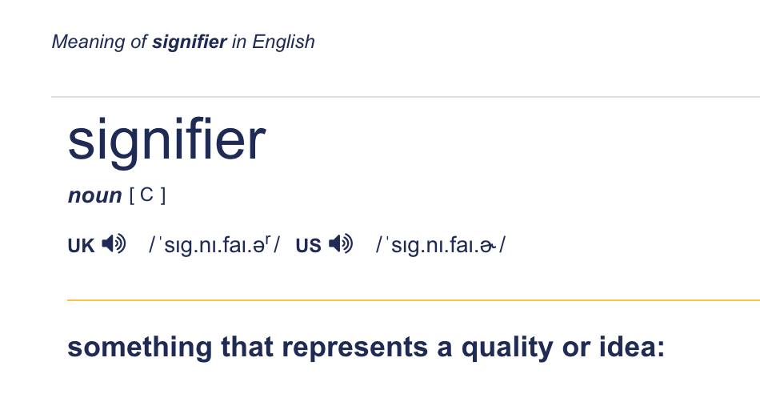

# Empty Signifiers
unfortunately, not a technical talk.

---

# Signifier

---
# An assumption of understanding...

makes communication faster and simpler

reinforces relationships

---

## People ...

... who do things

and

... who arrange for things to be done.

---

## People ...

...who need the detail 

and 

... who have to work with or partial knowledge

---

## People ...

... who are trying to do a thing

and 

... who are trying to get lots of things done in alignment

<!-- -
Not really different people
-->

--- 

# To get everybody on the same page

Abtract away the detail and get everybody to agree on the principle.

We can all come together under the banner of Agile, right?

We all mean the same thing when we say TDD, right?

---

# But then comes the detail

... and the nuance

... and other ideas

... and dilution of the core concept
 
... and certifications

## And detail needed by practitioners is lost or blurred

---

# Ask for clarity

It doesn't mean you don't understand.

It just means you want to understand it the same way.

"I do not think it means what you think it means" 

